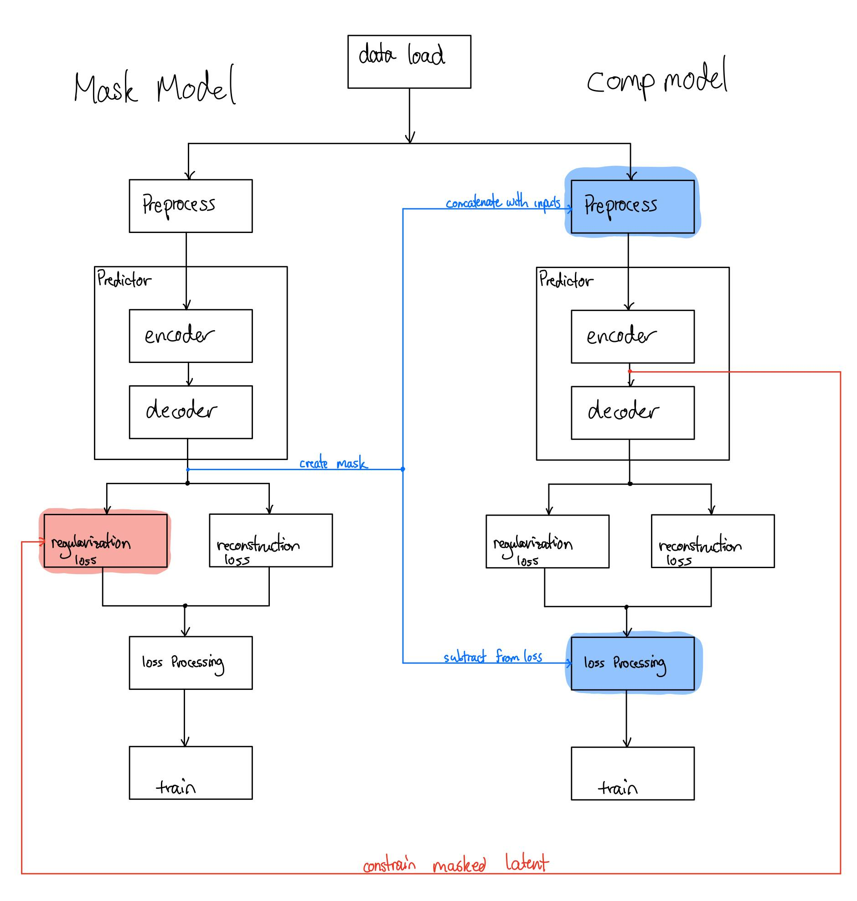
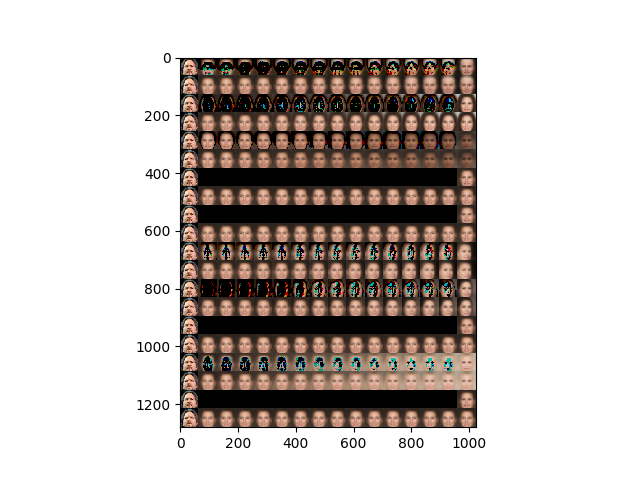
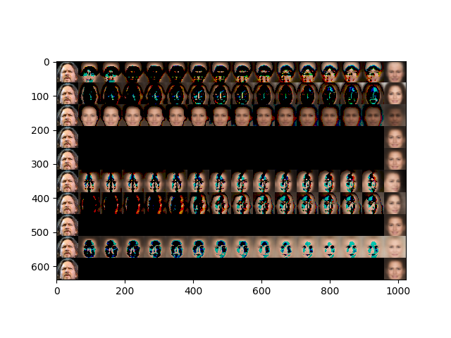

# Needs To Be Updated

## Setup:
Requires my library repo, please add that to your PYTHONPATH, such that the utils module can be used.
## Pipeline:

Here is the model Pipeline. DualModelHandler() in model.py creates this pipeline.
- the blue parts representing usage of the mask in the loss and the preprocessing is done in config.py.  

## Folders and Files:

### view.py:
- used to visualize models and run inference

### exec.py:
- this is the file that runs experiments.

### figures
- this folder holds the images used for this readme

### core
This folder holds the tools necessary to run experiments.

#### core/config
core/config/config.py:
- this is one of the files. 
- contains configurations for models to use.
- these are used as default then overwritten by setting attributes.

core/config/addition.py:
- additional functions that are applied to config instances for relevant additional options
- this includes converting a config to be compatible with mask network and a config to be compatible with a comp network 

#### core/model
core/model/model.py:
- this is one of the _main_ files. 
- contains handler objects. These objects load configs into keras models and allow easy training and saving.

core/model/achitectures.py:
- this contains relevant ML architectures such as a modified VAE.

#### core/train
core/train/manager.py:
- Contains training manager objects. These objects train a keras model. This will run the training loop.

core/train/optimizer.py:
- contains the optimzer manager objects, which are used to optimize specific models during training
- These optimizers create the gradient tape, and optimizes. (gradient tape should be custom if model requires custom arguments during inference)

#### utilities
utilities/standard.py:
- commonly used functions and objects across this project.

utilities/mask.py
- commonly used mask functions and objects across this project.

#### queue:
- this is a folder used in the backend. This holds a queueing function which can take jobs and run them.
- currently being worked on. TBD.

## Research Journal
Here are some research notes.

### Experiment 1: Train BetaTCVAE, Create Mask by Randomizing Latents (Current)
This experiment will try to create a mask by randomizing nuisance latent variables. These should randomize latents according to correlation between the latent variable of interest.
There should be a degree of correlation between all of these variables since we are focusing on data that contain one object.

We can make the mask by subtracting with original generated image, an applying a proportional gaussian filter onto the image, creating a mask

#### Experiment 1.1: Mask type - small change in selected element
Purpose - create mask for current image

##### Experiment 1.1.1: Initial Mask Creation

We can see in the images below that the effects on the mask The mask was made using a threshold of 0.005, to determine what to mask. These are the deltas of image i and image i+1. 

##### Experiment 1.1.2: Varying differences in delta
TBD

#### Experiment 1.2: Mask type - small change in selected element while randomizing the image to other elements
Purpose - randomization causes the conditioned latent dimension to ignore the other latents which are correlated.

TBD

### Experiment 2: Connect Masks with Original Images
#### Experiment 2.1: Data creation

##### Experiment 2.1.1: create masking object and apply it to the original image, analysis of effects
Coding process:
- Done Mask object creation

##### Experiment 2.1.2: resize masking image and apply it to a larger image, analysis of effects
- TBD, there also seems to be enough information in images

##### Experiment 2.1.3: apply to images and create dataset

#### Experiment 2.2: Model Training
Expectations:
- might not work due to:
	- incomplete information
		- small sample size on variance between images, the reconstructed image is all the information needed to distinguish between the faces in the training dataset.
		- My project will not be able to solve this, as this is a data issue.

- might work if:
	- low expressiveness
		- expressiveness of VAEs are limiting as being constrained by the prior,
		- my project will help with this. 
	- if VAEs do pursue PCA
		- the child vae will have one element of variance to focus on, and the noise that comes with it. The noise should be factors that "didn't make the cut" due to regularization
			- similar to discarding low variances on PCA basis regularizations
		- here we can leverage the variances further if we include some information for related factors, perhaps Experiment 1.2 would help with is?

1. run model
- try masking the input before prediction
	- currently preprocessing the inputs by concatenating the mask.
	- So vae learns the mask as well.
	- Same style as MONet.

- try masking the loss
	- though might need to change beta as KLD might have a stronger effect?
		- maybe not if getting the mean of the KLD and the mean of the mse
	- this works better, doesn't corrupt the inputs (though masking both is fine too)
	- Features like azimuth is still being represented, and the feature constructions are mostly similar
		- This is expected asn the masking doesn't remove position or azimuth
		- it seems like we need to remove these features through conditioning on latents. We can try minimizing the mutual information between latents

2. run regular model with same size images for baseline
3. analysis of results

### Experiment 3: Retrain original model
#### Experiment 3.1: Conditioning Original Model on Other Trained Model
